# SetupPythonDev

## Installation

0. `sudo apt install curl`
1. Run `curl https://raw.githubusercontent.com/justin-p/SetupPythonDev/main/setup.sh | bash`
2. Enter sudo password.
3. Reboot the system.

## Configure repository

1. Open a bash shell as root and start pycharm-community

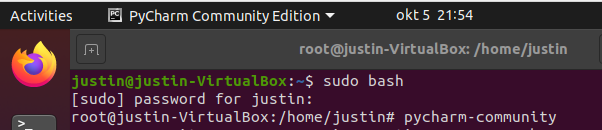

2. Follow the setup and click skip on this page

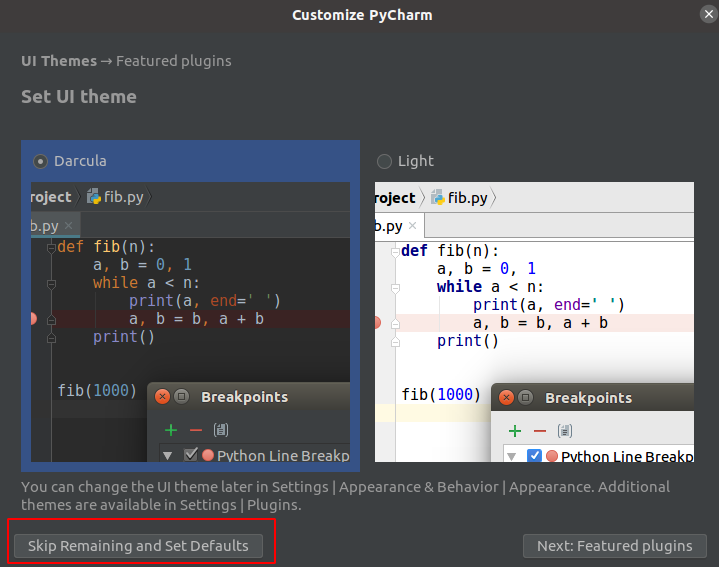

3. Click on `get from version control`

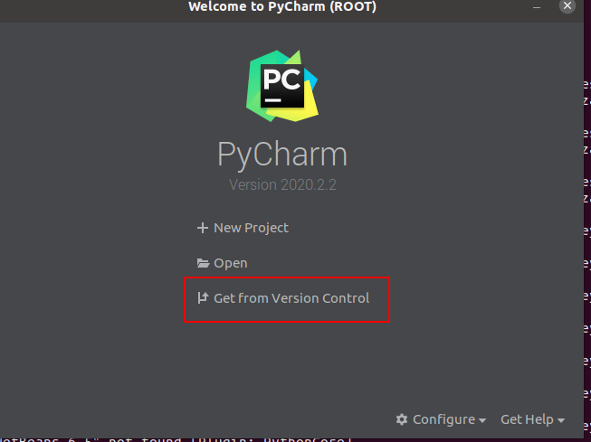

4. Enter the following url `https://github.com/justin-p/impacket`

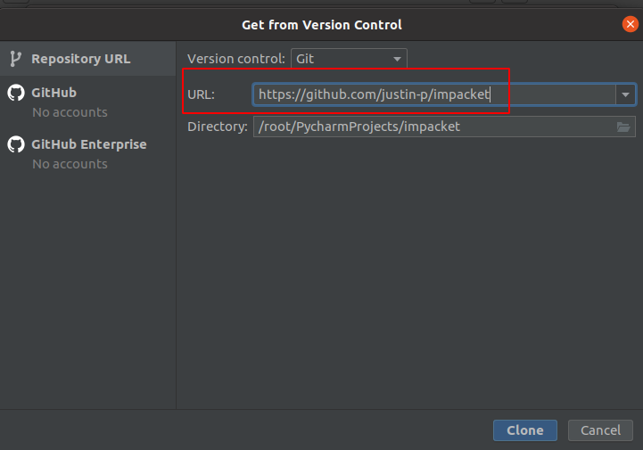

5. Wait for `module indexing` and `Updating skeletons` to finish.

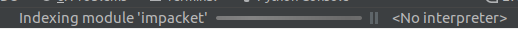

6. Ensure Python 3.8 is selected as the interpreter

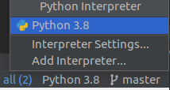

7. double click on the file `impacket/smbserver.py` and wait for `Analyzing` to finish.

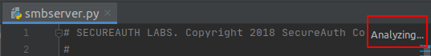

8. Click on `Install requirements`

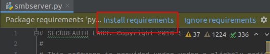

9. Click on `Install`

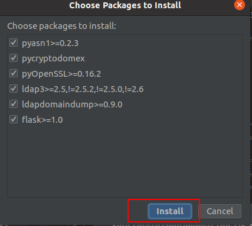

10. Click on `Add Configuration`

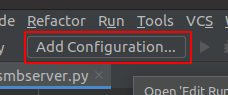

11. Click on the plus sign, then `Python`

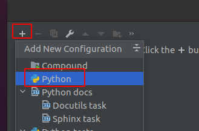

12. Set up the configuration as the example below.

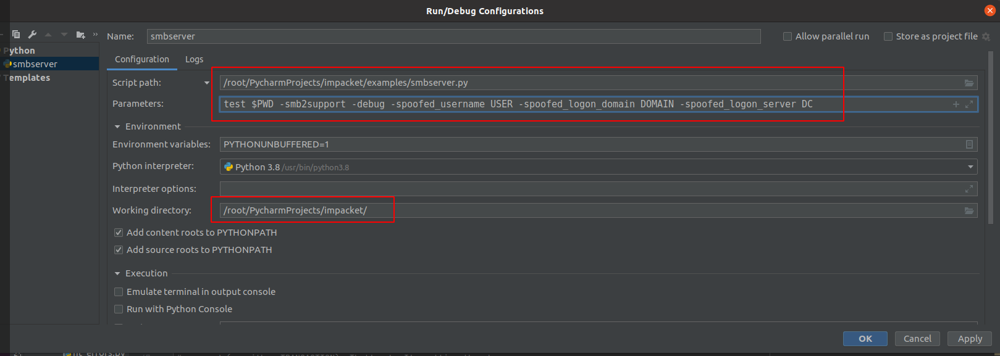

Script path: `/root/PycharmProject/impacket/examples/smbserver.py`

Parameters: `test $PWD -smb2support -debug -spoofed_username USER -spoofed_logon_domain DOMAIN -spoofed_logon_server DC`

Note, update the `-spoofed_` values to match the user you want to spoof.

Working Directory: `/root/PycharmProjects/impacket`

13. Press the green play button to start the script.

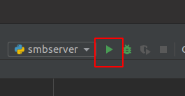
